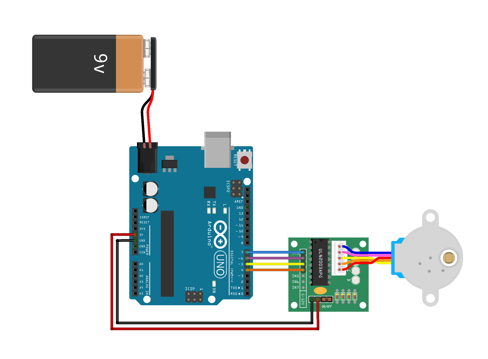

# Otomatik Balık Yemleme Sistemi / Automatic Fish Feeder 🐟

[TR] Bu proje, akvaryum canlılarınız için belirli aralıklarla yem sağlamak amacıyla tasarlanmış otomatik bir yemleme sistemidir. Hassas porsiyon kontrolü için 28BYJ-48 step motor kullanır.

[EN] This project is an automated fish feeding system designed to provide food for your aquarium inhabitants at specific intervals. It uses a 28BYJ-48 stepper motor for precise portion control.

---

## 🚀 Özellikler / Features

**[TR]**
- **Hassas Kontrol:** Doğru rotasyon için step motor kullanımı.
- **Ayarlanabilir Aralıklar:** Kod üzerinden yemleme sıklığını kolayca değiştirme.
- **Düşük Güç:** Uzun süreli çalışma için optimize edilmiştir.

**[EN]**
- **Precise Control:** Uses a stepper motor for accurate rotation.
- **Adjustable Intervals:** Easy to modify feeding frequency via code.
- **Low Power:** Optimized for long-term operation.

---

## 🛠 Donanım Bileşenleri / Hardware Components

- **Microcontroller:** Arduino (Uno/Nano or compatible)
- **Motor:** 28BYJ-48 Stepper Motor
- **Driver:** ULN2003 Stepper Motor Driver
- **Power:** 5V/9V DC Power Supply
- **Mechanical:** 3D Printed dispenser and enclosure

---

## 🔌 Bağlantı Şeması / Wiring Diagram

| Component (ULN2003) | Arduino Pin |
|---------------------|-------------|
| IN1                 | 7           |
| IN2                 | 6           |
| IN3                 | 5           |
| IN4                 | 4           |
| VCC                 | 5V          |
| GND                 | GND         |

---

## 📝 Geliştirici Notu / Developer Note

**[TR]** Değişken isimleri ve kod yapısı, küresel programlama standartlarını takip etmek için **İngilizce** olarak hazırlanmıştır. Yerel kullanıcılar için detaylı açıklamalar **Türkçe** yorum satırları ile belirtilmiştir.

**[EN]** The variable names and code structure are in **English** to follow global programming standards, while the comments are in **Turkish** to provide detailed explanations for local users.

---

## 🔗 Kaynaklar / Resources & Credits

- **3D Files:** [Thingiverse (by leventerzin)](https://www.thingiverse.com/thing:3093429)
- **Video Tutorial:** [Orhan Celep - Robotik Projeler](https://www.youtube.com/watch?v=It2zWWw2ThI)

---

## 📜 Lisans / License
This project is licensed under the **MIT License**.